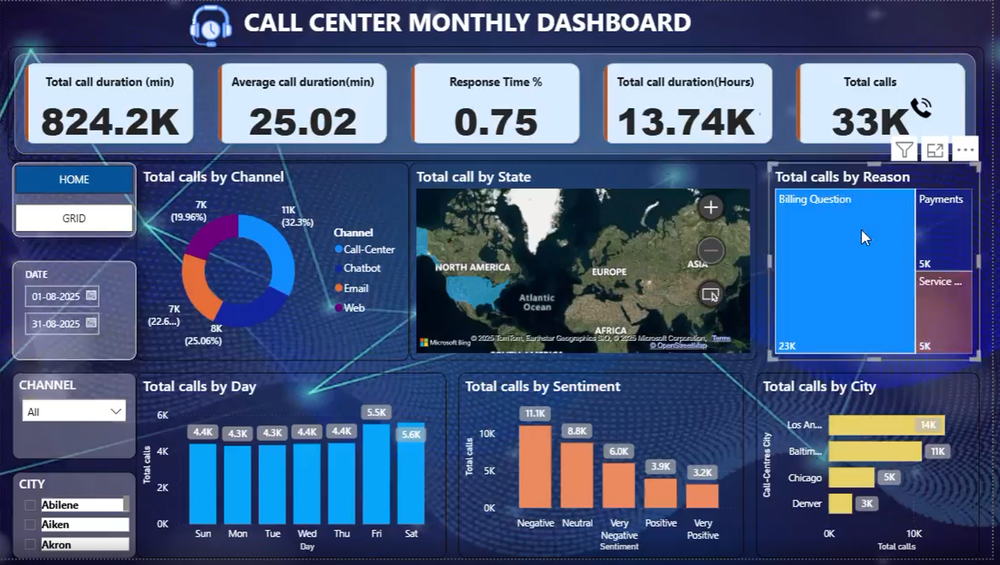

# Call Center Monthly Dashboard (Power BI)

## 📊 Dashboard Preview

https://github.com/RUDRAPRAKASHDAS/Call-Center-Monthly-Dashboard-Power-BI/blob/main/Call%20Center%20Monthly%20Dashboard.png

## 📌 Overview

This project features a comprehensive **Call Center Monthly Dashboard** developed using **Power BI**. The primary goal is to transform raw operational data into actionable insights, enabling management to monitor performance, analyze key metrics, and make data-driven decisions to improve overall call center efficiency and customer satisfaction.

## ✨ Key Features & KPIs

The dashboard provides a 360-degree view of call center operations through the following metrics and analyses:

### 📊 Key Performance Indicators (KPIs)
- **Total Call Duration:** `824.2K minutes` (Equivalent to `13.74K hours`)
- **Average Call Duration:** `25.02 minutes`
- **Total Calls:** `33K`
- **Response Time %:** `0.75%`

### 📈 Performance Insights
- **Channel Analysis:** Distribution of customer interactions across **Call Center**, **Email**, **Chatbot**, and **Web**
- **State & City Analysis:** Geographic mapping of call volumes to identify regional trends
- **Reason Analysis:** Categorization of calls into **Billing Questions**, **Payments**, and **Service Outages**
- **Sentiment Analysis:** Customer calls segmented by sentiment (**Positive**, **Negative**, **Neutral**)
- **Day-wise Trends:** Daily call volume patterns for workforce planning

## 💡 Business Impact

This dashboard empowers decision-makers to:

- ✅ **Reduce Average Handling Time (AHT)** by identifying bottlenecks
- ✅ **Improve Customer Satisfaction (CSAT)** by tracking sentiment
- ✅ **Optimize Resource Allocation** based on day-wise and geographic trends
- ✅ **Identify Recurring Customer Issues** via reason and channel analysis

## 🛠️ Tools Used

- **Power BI** - Data modeling, DAX calculations, visualization
- **Microsoft Excel** - Data cleaning & preparation

## 📁 Repository Files

- `Call Center Monthly Dashboard.pbix` - Main Power BI file
- `Call Center_Call Center.csv` - Raw dataset
- `Call Center Monthly Dashboard.png` - Dashboard screenshot

## 🚀 How to Use

1. Clone the repository
2. Open `Call Center Monthly Dashboard.pbix` in Power BI Desktop
3. Refresh data if needed
4. Explore interactive visualizations

## 👤 Author

**Rudra Prakash Das**

---

⭐ Star this repository if you find it useful!
